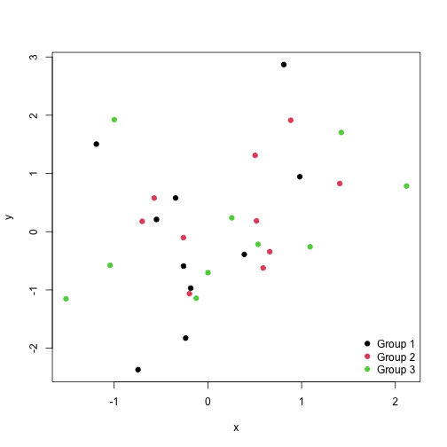
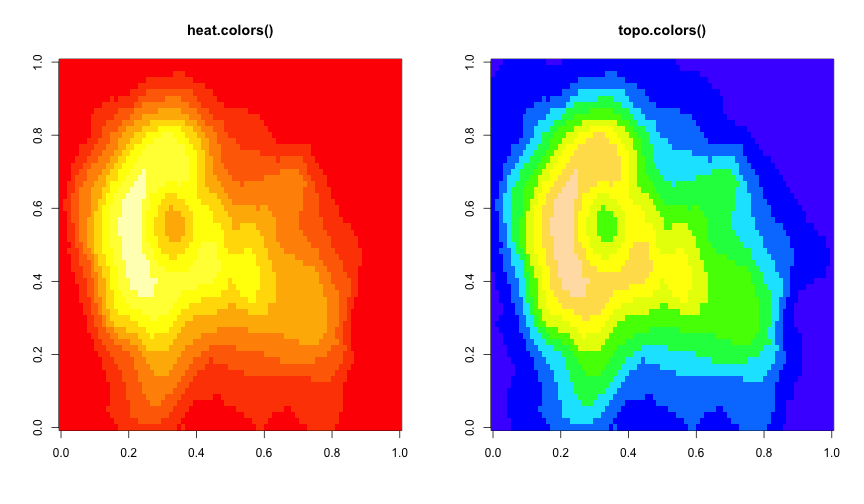
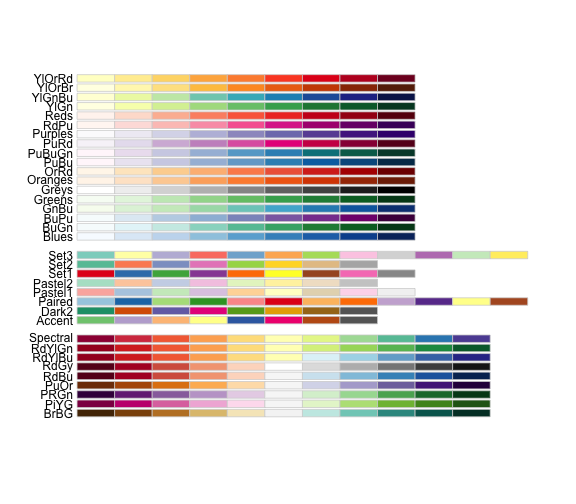
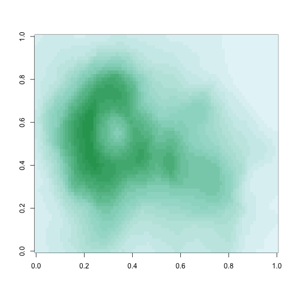
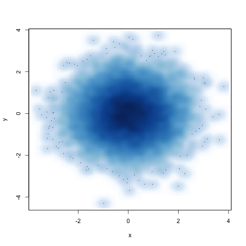
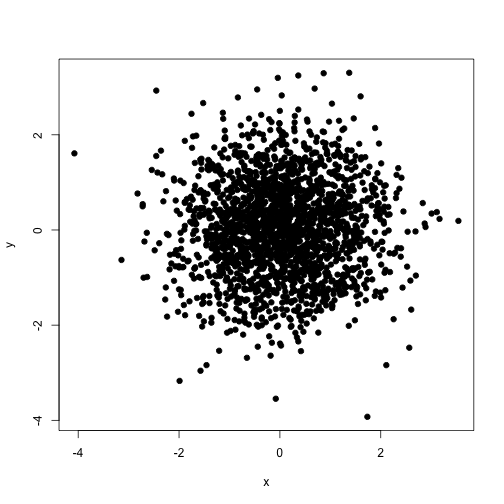
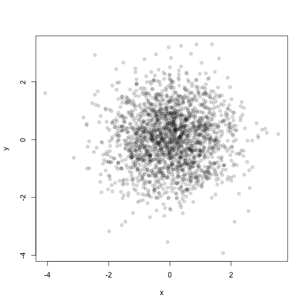

# Plotting and Color in R

Watch a video of this chapter: [Part 1](https://youtu.be/7QaR91TCc3k) [Part 2](https://youtu.be/3Q1ormd5oMA) [Part 3](https://youtu.be/4JJfGpVHTq4) [Part 4](https://youtu.be/9-cn0auNV58)

The default color schemes for most plots in R are horrendous. I am as guilty as anyone of using these horrendous color schemes but I am actively trying to work at improving my habits. R has much better ways for handling the specification of colors in plots and graphs and you should make use of them when possible. But, in order to do that, it's important to know a little about how colors work in R.

## Colors 1, 2, and 3

Quite often, with plots made in R, you'll see something like the following Christmas-themed plot.

~~~~~~~~
> set.seed(19)
> x <- rnorm(30)
> y <- rnorm(30)
> plot(x, y, col = rep(1:3, each = 10), pch = 19)
> legend("bottomright", legend = paste("Group", 1:3), col = 1:3, pch = 19, bty = "n")
~~~~~~~~

The reason is simple. In R, the color black is denoted by `col = 1` in most plotting functions, red is denoted by `col = 2`, and green is denoted by `col = 3`. So if you're plotting multiple groups of things, it's natural to plot them using colors 1, 2, and 3.

Here's another set of common color schemes used in R, this time via the `image()` function.

~~~~~~~~
> par(mfrow = c(1, 2))
> image(volcano, col = heat.colors(10), main = "heat.colors()")
> image(volcano, col = topo.colors(10), main = "topo.colors()")
~~~~~~~~

## Connecting colors with data

Typically we add color to a plot, not to improve its artistic value, but to add another dimension to the visualization (i.e. to ["escape flatland"](http://www.edwardtufte.com/tufte/books_vdqi)). Therefore, it makes sense that *the range and palette of colors you use will depend on the kind of data you are plotting*. While it may be common to just choose colors at random, choosing the colors for your plot should require careful consideration. Because careful choices of plotting color can have an impact on how people interpret your data and draw conclusions from them.

## Color Utilities in R

R has a number of utilities for dealing with colors and color palettes in your plots. For starters, the `grDevices` package has two functions 

* `colorRamp`: Take a palette of colors and return a function that takes valeus between 0 and 1, indicating the extremes of the color palette (e.g. see the `gray()` function)

* `colorRampPalette`: Take a palette of colors and return a function that takes integer arguments and returns a vector of colors interpolating the palette (like `heat.colors()` or `topo.colors()`)

Both of these functions take palettes of colors and help to interpolate between the colors on the palette. They differ only in the type of object that they return.

Finally, the function `colors()` lists the names of colors you can use in any plotting function. Typically, you would specify the color in a (base) plotting function via the `col` argument.

## `colorRamp()`

For both `colorRamp()` and `colorRampPalette()`, imagine you're a painter and you have your palette in your hand. On your palette are a set of colors, say red and blue. Now, between red and blue you can a imagine an entire spectrum of colors that can be created by mixing together different amounts of read and blue. Both `colorRamp()` and `colorRampPalette()` handle that "mixing" process for you.

Let's start with a simple palette of "red" and "blue" colors and pass them to `colorRamp()`.

~~~~~~~~
> pal <- colorRamp(c("red", "blue"))
> pal(0)
     [,1] [,2] [,3]
[1,]  255    0    0
~~~~~~~~

Notice that `pal` is in fact a function that was returned by `colorRamp()`. When we call `pal(0)` we get a 1 by 3 matrix. The numbers in the matrix will range from 0 to 255 and indicate the quantities of red, green, and blue (RGB) in columns 1, 2, and 3 respectively. Simple math tells us there are over 16 million colors that can be expressed in this way. Calling `pal(0)` gives us the maximum value (255) on red and 0 on the other colors. So this is just the color red.

We can pass any value between 0 and 1 to the `pal()` function.

~~~~~~~~
> ## blue
> pal(1)
     [,1] [,2] [,3]
[1,]    0    0  255
> 
> ## purple-ish
> pal(0.5)
      [,1] [,2]  [,3]
[1,] 127.5    0 127.5
~~~~~~~~

You can also pass a sequence of numbers to the `pal()` function.

~~~~~~~~
> pal(seq(0, 1, len = 10))
           [,1] [,2]      [,3]
 [1,] 255.00000    0   0.00000
 [2,] 226.66667    0  28.33333
 [3,] 198.33333    0  56.66667
 [4,] 170.00000    0  85.00000
 [5,] 141.66667    0 113.33333
 [6,] 113.33333    0 141.66667
 [7,]  85.00000    0 170.00000
 [8,]  56.66667    0 198.33333
 [9,]  28.33333    0 226.66667
[10,]   0.00000    0 255.00000
~~~~~~~~

The idea here is that `colorRamp()` gives you a function that allows you to interpolate between the two colors red and blue. You do not have to provide just two colors in your initial color palette; you can start with multiple colors and `colorRamp()` will interpolate between all of them.

## `colorRampPalette()`

The `colorRampPalette()` function in manner similar to `colorRamp(()`, however the function that it returns gives you a fixed number of colors that interpolate the palette.

~~~~~~~~
> pal <- colorRampPalette(c("red", "yellow"))
~~~~~~~~

Again we have a function `pal()` that was returned by `colorRampPalette()`, this time interpolating a palette containing the colors red and yellow. But now, the `pal()` function takes an integer argument specifing the number of interpolated colors to return.

~~~~~~~~
> ## Just return red and yellow
> pal(2)
[1] "#FF0000" "#FFFF00"
~~~~~~~~

Note that the colors are represented as hexadecimal strings. After the # symbol, the first two characters indicate the red amount, the second two the green amount, and the last two the blue amount. Because each position can have 16 possible values (0-9 and A-F), the two positions together allow for 256 possibilities per color. In this example above, since we only asked for two colors, it gave us red and yellow, the two extremes of the palette. 

We can ask for more colors though.

~~~~~~~~
> ## Return 10 colors in between red and yellow
> pal(10)
 [1] "#FF0000" "#FF1C00" "#FF3800" "#FF5500" "#FF7100" "#FF8D00" "#FFAA00"
 [8] "#FFC600" "#FFE200" "#FFFF00"
~~~~~~~~

You'll see that the first color is still red ("FF" in the red position) and the last color is still yellow ("FF" in both the red and green positions). But now there are 8 more colors in between. These values, in hexadecimal format, can also be specified to base plotting functions via the `col` argument.

Note that the `rgb()` function can be used to produce any color via red, green, blue proportions and return a hexadecimal representation.

~~~~~~~~
> rgb(0, 0, 234, maxColorValue = 255)
[1] "#0000EA"
~~~~~~~~

## RColorBrewer Package

Part of the art of creating good color schemes in data graphics is to start with an appropriate color palette that you can then interpolate with a function like `colorRamp()` or `colorRampPalette()`. One package on CRAN that contains interesting and useful color palettes is the [`RColorBrewer`](http://cran.r-project.org/package=RColorBrewer) package.

The `RColorBrewer` packge offers three types of palettes
  
  - Sequential: for numerical data that are ordered
  
  - Diverging: for numerical data that can be positive or negative, often representing deviations from some norm or baseline
  
  - Qualitative: for qualitative unordered data

All of these palettes can be used in conjunction with the `colorRamp()` and `colorRampPalette()`.

Here is a display of all the color palettes available from the `RColorBrewer` package.

~~~~~~~~
> library(RColorBrewer)
> display.brewer.all()
~~~~~~~~

## Using the RColorBrewer palettes

The only real function in the `RColorBrewer` package is the `brewer.pal()` function which has two arguments

* `name`: the name of the color palette you want to use

* `n`: the number of colors you want from the palette (integer)

Below we choose to use 3 colors from the "BuGn" palette, which is a sequential palette.

~~~~~~~~
> library(RColorBrewer)
> cols <- brewer.pal(3, "BuGn")
> cols
[1] "#E5F5F9" "#99D8C9" "#2CA25F"
~~~~~~~~

Those three colors make up my initial palette. Then I can pass them to `colorRampPalette()` to create my interpolating function.

~~~~~~~~
> pal <- colorRampPalette(cols)
~~~~~~~~

Now I can plot the `volcano` data using this color ramp. Note that the `volcano` dataset contains elevations of a volcano, which is continuous, ordered, numerical data, for which a sequential palette is appropriate.

~~~~~~~~
> image(volcano, col = pal(20))
~~~~~~~~

## The `smoothScatter()` function

A function that takes advantage of the color palettes in `RColorBrewer` is the `smoothScatter()` function, which is very useful for making scatterplots of very large datasets. The `smoothScatter()` function essentially gives you a 2-D histogram of the data using a sequential palette (here "Blues").

~~~~~~~~
> set.seed(1)
> x <- rnorm(10000)
> y <- rnorm(10000)
> smoothScatter(x, y)
~~~~~~~~

## Adding transparency

Color transparency can be added via the `alpha` parameter to `rgb()` to produce color specifications with varying levels of transparency. When transparency is used you'll notice an extra two characters added to the right side of the hexadecimal representation (there will be 8 positions instead of 6).

For example, if I wanted the color red with a high level of transparency, I could specify

~~~~~~~~
> rgb(1, 0, 0, 0.1)
[1] "#FF00001A"
~~~~~~~~

Transparency can be useful when you have plots with a high density of points or lines. For example, teh scatterplot below has a lot of overplotted points and it's difficult to see what's happening in the middle of the plot region.

~~~~~~~~
> set.seed(2)
> x <- rnorm(2000)
> y <- rnorm(2000)
> plot(x, y, pch = 19)
~~~~~~~~

If we add some transparency to the black circles, we can get a better sense of the varying density of the points in the plot.

~~~~~~~~
> plot(x, y, pch = 19, col = rgb(0, 0, 0, 0.15))
~~~~~~~~

     
Better, right?

## Summary

* Careful use of colors in plots, images, maps, and other data graphics can make it easier for the reader to get what you're trying to say (why make it harder?). 

* The `RColorBrewer` package is an R package that provides color palettes for sequential, categorical, and diverging data 

* The `colorRamp` and `colorRampPalette` functions can be used in conjunction with color palettes to connect data to colors

* Transparency can sometimes be used to clarify plots with many points
