# Dimension Reduction

Watch a video of this chapter: [Part 1](https://youtu.be/ts6UQnE6E1U) [Part 2](https://youtu.be/BSfw0rpyC2g) [Part 3](https://youtu.be/drNwEvEx3LY)

## Matrix data 

The key aspect of matrix data is that every element of the matrix is the same type and represents the same kind of measurement. This is in contrast to a data frame, where every column of a data frame can potentially be of a different class. 

Matrix data have some special statistical methods that can be applied to them. One category of statistical dimension reduction techniques is commonly called *principal components analysis* (PCA) or the *singular value decomposition* (SVD). These techniques generally are applied in situations where the rows of a matrix represent observations of some sort and the columns of the matrix represent features or variables (but this is by no means a requirement). 

In an abstract sense, the SVD or PCA can be thought of as a way to approximate a high-dimensional matrix (i.e. a large number of columns) with a a few low-dimensional matrices. So there's a bit of data compression angle to it. We'll take a look at what's going on in this chapter.

First, we can simulate some matrix data. Here, we simulate some random Normal data in a matrix that has 40 rows and 10 columns.

~~~~~~~~
> set.seed(12345)
> dataMatrix <- matrix(rnorm(400), nrow = 40)
> image(1:10, 1:40, t(dataMatrix)[, nrow(dataMatrix):1])
~~~~~~~~

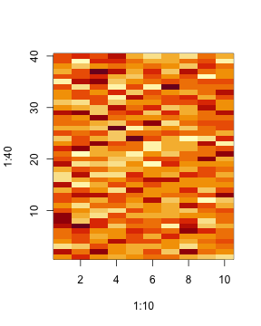

When confronted with matrix data a quick and easy thing to organize the data a bit is to apply an hierarchical clustering algorithm to it. Such a clustering can be visualized with the `heatmap()` function.

~~~~~~~~
> heatmap(dataMatrix)
~~~~~~~~

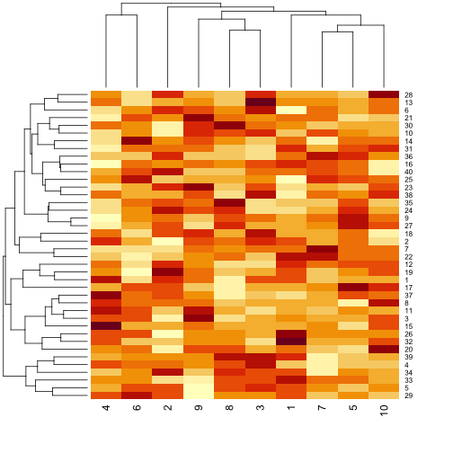

Not surprisingly, there aren't really any interesting patterns given that we just simulated random noise. At least it's good to know that the clustering algorithm won't pick up something when there's nothing there!

But now what if there were a pattern in the data? How would we discover it?

Let's first simulate some data that indeed does have a pattern. In the code below, we cycle through all the rows of the matrix and randomly add 3 to the last 5 columns of the matrix.

~~~~~~~~
> set.seed(678910)
> for (i in 1:40) {
+     coinFlip <- rbinom(1, size = 1, prob = 0.5)
+     
+     ## If coin is heads add a common pattern to that row
+     if (coinFlip) {
+         dataMatrix[i, ] <- dataMatrix[i, ] + rep(c(0, 3), each = 5)
+     }
+ }
~~~~~~~~

Here's what the new data look like. 

~~~~~~~~
> image(1:10, 1:40, t(dataMatrix)[, nrow(dataMatrix):1])
~~~~~~~~

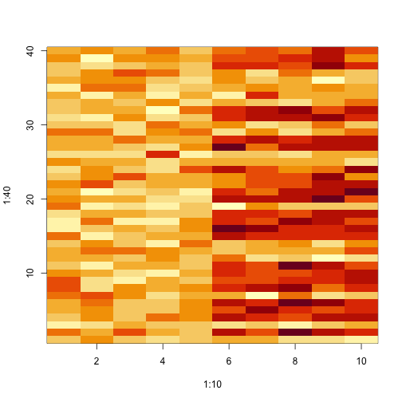

You can see that some of the rows on the right side of the matrix have higher values than on the left side.

Now what happens if we cluster the data?

~~~~~~~~
> heatmap(dataMatrix)
~~~~~~~~

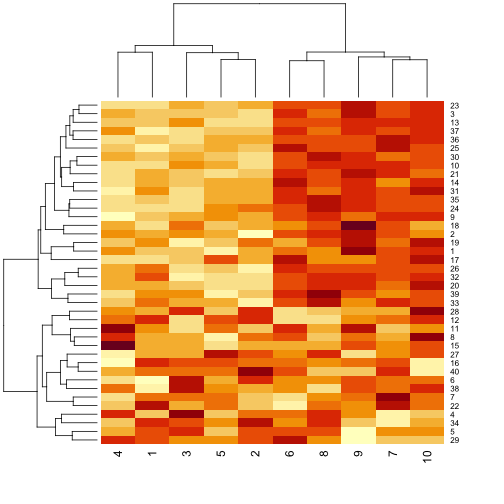

We can see from the dendrogram on top of the matrix (for the columns) that the columns pretty clearly split into two clusters, which is what we'd expect. 

## Patterns in rows and columns

In general, with matrix data, there may be patterns that occur accross the rows and columns of the matrix. In the example above, we shifted the mean of some of the observations in columns 5 through 10. We can display this a bit more explicitly by looking at the row and column means of the data.

~~~~~~~~
> library(dplyr)
> hh <- dist(dataMatrix) %>% hclust
> dataMatrixOrdered <- dataMatrix[hh$order, ]
> par(mfrow = c(1, 3))
> 
> ## Complete data
> image(t(dataMatrixOrdered)[, nrow(dataMatrixOrdered):1])
> 
> ## Show the row means
> plot(rowMeans(dataMatrixOrdered), 40:1, , xlab = "Row Mean", ylab = "Row", pch = 19)
> 
> ## Show the column means
> plot(colMeans(dataMatrixOrdered), xlab = "Column", ylab = "Column Mean", pch = 19)
~~~~~~~~

However, there may be other patterns beyond a simple mean shift and so more sophisticated methods will be needed. Futhermore, there may be multiple patterns layered on top of each other so we need a method that can distangle these patterns.

## Related problem

Here's another way to formulate the problem that matrix data present. Suppose you have multivariate observations

{$$}
X_1,\ldots,X_n
{/$$}

so that each of the *n* observations has *m* features,

{$$}
X_1 = (X_{11},\ldots,X_{1m})
{/$$}

Given this setup, the goal is to find a new set of variables/features that are uncorrelated and explain as much variance in the data as possible. Put another way, if you were to put all these multivariate observations together in one matrix, find the *best* matrix created with fewer variables (lower rank) that explains the original data.

The first goal is *statistical* in nature and the second goal is perhaps better characterized as *lossy data compression*.

## SVD and PCA

If *X* is a matrix with each variable in a column and each observation in a row then the SVD is a matrix decomposition that represents *X* as a matrix product of three matrices:

{$$}
X = UDV^\prime
{/$$}

where the columns of *U* (left singular vectors) are orthogonal, the columns of {$$}V{/$$} (right singular vectors) are orthogonal and {$$}D{/$$} is a diagonal matrix of singular values. 

Principal components analysis (PCA) is simply an application of the SVD. The *principal components* are equal to the right singular values if you first scale the data by subtracting the column mean and dividing each column by its standard deviation (that can be done with the `scale()` function).

## Unpacking the SVD: *u* and *v*

The SVD can be computed in R using the `svd()` function. Here, we scale our original matrix data with the pattern in it and apply the svd.

~~~~~~~~
> svd1 <- svd(scale(dataMatrixOrdered))
~~~~~~~~

The `svd()` function returns a list containing three components named `u`, `d`, and `v`. The `u` and `v` components correspond to the matrices of left and right singular vectors, respectively, while the `d` component is a vector of singular values, corresponding to the diagonal of the matrix *D* described above.

Below we plot the first left and right singular vectors along with the original data.

~~~~~~~~
> par(mfrow = c(1, 3))
> image(t(dataMatrixOrdered)[, nrow(dataMatrixOrdered):1], main = "Original Data")
> plot(svd1$u[, 1], 40:1, , ylab = "Row", xlab = "First left singular vector", pch = 19)
> plot(svd1$v[, 1], xlab = "Column", ylab = "First right singular vector", pch = 19)
~~~~~~~~

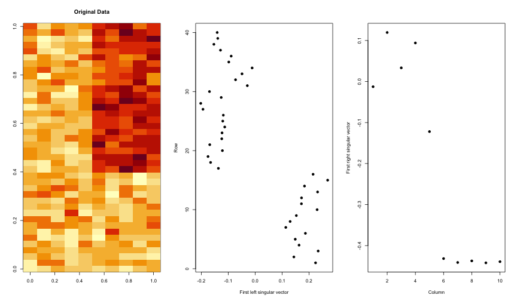

You can see how the first left and right singular vectors pick up the mean shift in both the rows and columns of the matrix. 

## SVD for data compression

If we believed that the first left and right singular vectors, call them u1 and v1, captured all of the variation in the data, then we could approximate the original data matrix with

{$$}
X \approx u_1 v_1^\prime
{/$$}

Thus, we would reduce 400 numbers in the original matrix to 40 + 10 = 50 numbers in the compressed matrix, a nearly 90% reduction in information. Here's what the original data and the approximation would look like.

~~~~~~~~
> ## Approximate original data with outer product of first singular vectors
> approx <- with(svd1, outer(u[, 1], v[, 1]))
> 
> ## Plot original data and approximated data
> par(mfrow = c(1, 2))
> image(t(dataMatrixOrdered)[, nrow(dataMatrixOrdered):1], main = "Original Matrix")
> image(t(approx)[, nrow(approx):1], main = "Approximated Matrix")
~~~~~~~~

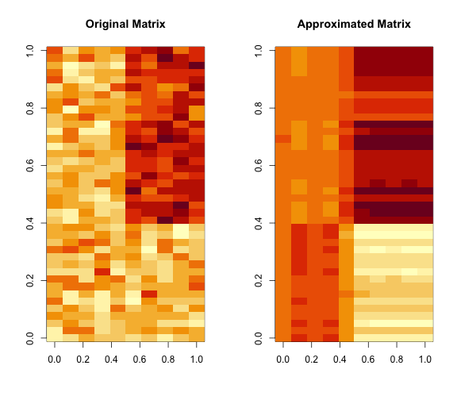

Obviously, the two matrices are not identical, but the approximation seems reasonable in this case. This is not surprising given that there was only one real feature in the original data.

## Components of the SVD - Variance explained

The statistical interpretation of singular values is in the form of variance in the data explained by the various components. The singular values produced by the `svd()` are in order from largest to smallest and when squared are proportional the amount of variance explained by a given singular vector. 

To show how this works, here's a very simple example. First, we'll simulate a "dataset" that just takes two values, 0 and 1.

~~~~~~~~
> constantMatrix <- dataMatrixOrdered * 0
> for (i in 1:dim(dataMatrixOrdered)[1]) {
+     constantMatrix[i, ] <- rep(c(0, 1), each = 5)
+ }
~~~~~~~~

Then we can take the SVD of this matrix and show the singular values as well as the proportion of variance explained.

~~~~~~~~
> svd1 <- svd(constantMatrix)
> par(mfrow = c(1, 3))
> image(t(constantMatrix)[, nrow(constantMatrix):1], main = "Original Data")
> plot(svd1$d, xlab = "Column", ylab = "Singular value", pch = 19)
> plot(svd1{$$}d^2/sum(svd1{/$$}d^2), xlab = "Column", ylab = "Prop. of variance explained", 
+     pch = 19)
~~~~~~~~

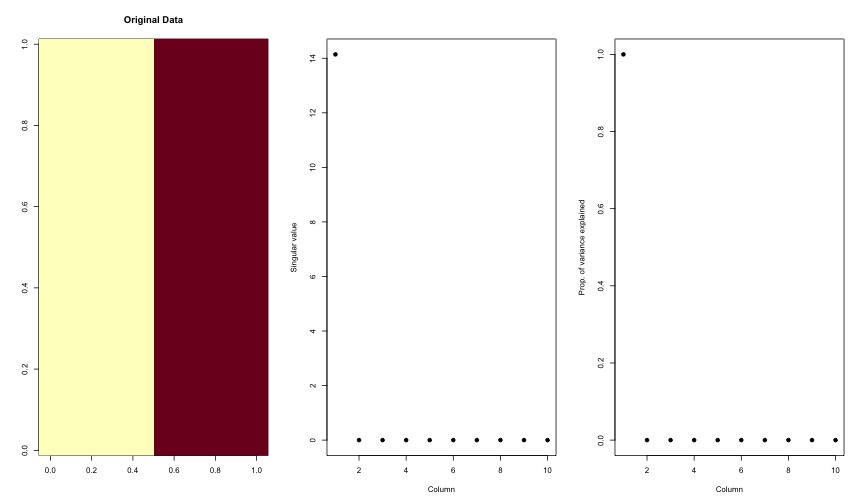

As we can see from the right-most plot, 100% of the variation in this "dataset" can be explained by the first singular value. Or, all of the variation in this dataset occurs in a single dimension. This is clear because all of the variation in the data occurs as you go from left to right across the columns. Otherwise, the values of the data are constant. 

In the plot below, we plot the singular values (left) and the proportion of variance explained for the slightly more complex dataset that we'd been using previously.

~~~~~~~~
> par(mfrow = c(1, 2))
> svd1 <- svd(scale(dataMatrixOrdered))
> plot(svd1$d, xlab = "Column", ylab = "Singular value", pch = 19)
> plot(svd1{$$}d^2/sum(svd1{/$$}d^2), xlab = "Column", ylab = "Prop. of variance explained", 
+     pch = 19)
~~~~~~~~

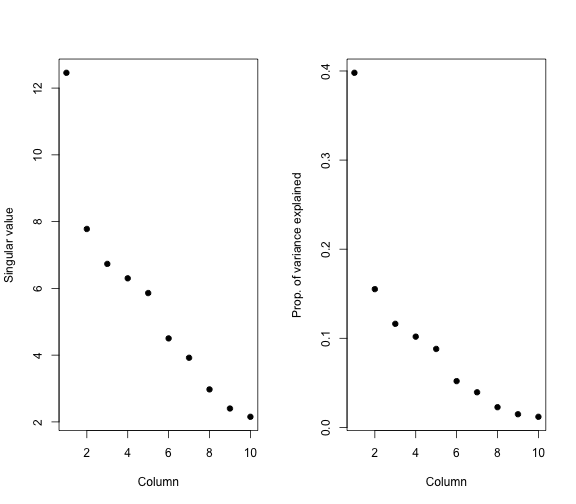

We can see that the first component explains about 40% of all the variation in the data. In other words, even though there are 10 dimensions in the data, 40% of the variation in the data can be explained by a single dimension. That suggests that the data could be simplified quite a bit, a phenomenon we observed in the last section where it appeared the data could be reasonably approximated by the first left and right singular vectors.

## Relationship to principal components

As we mentioned above, the SVD has a close connection to principal components analysis (PCA). PCA can be applied to the data by calling the `prcomp()` function in R. Here, we show that the first right singular vector from the SVD is equal to the first principal component vector returned by PCA.

~~~~~~~~
> svd1 <- svd(scale(dataMatrixOrdered))
> pca1 <- prcomp(dataMatrixOrdered, scale = TRUE)
> plot(pca1$rotation[, 1], svd1$v[, 1], pch = 19, xlab = "Principal Component 1", ylab = "Right Singular Vector 1")
> abline(c(0, 1))
~~~~~~~~

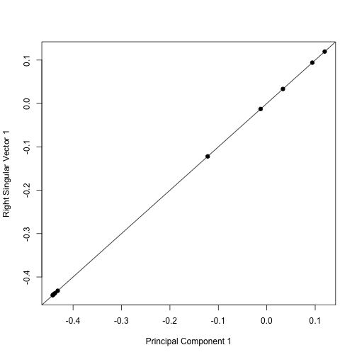

Whether you call this procedure SVD or PCA really just depends on who you talk to. Statisticians and people with that kind of background will typically call it PCA while engineers and mathematicians will tend to call it SVD.

## What if we add a second pattern?

Tracking a single patter in a matrix is relatively straightforward, but typically there will be multiple layered patterns in a matrix of data. Here we add two patterns to a simulated dataset. One pattern simple adds a constant to the last 5 columns of data, while the other pattern adds an alternating pattern (every other column).

~~~~~~~~
> set.seed(678910)
> for (i in 1:40) {
+     coinFlip1 <- rbinom(1, size = 1, prob = 0.5)
+     coinFlip2 <- rbinom(1, size = 1, prob = 0.5)
+     if (coinFlip1) {
+         ## Pattern 1
+         dataMatrix[i, ] <- dataMatrix[i, ] + rep(c(0, 5), each = 5)
+     }
+     if (coinFlip2) {
+         ## Pattern 2
+         dataMatrix[i, ] <- dataMatrix[i, ] + rep(c(0, 5), 5)
+     }
+ }
> hh <- hclust(dist(dataMatrix))
> dataMatrixOrdered <- dataMatrix[hh$order, ]
~~~~~~~~

Here is a plot of this new dataset along with the two different patterns.

~~~~~~~~
> svd2 <- svd(scale(dataMatrixOrdered))
> par(mfrow = c(1, 3))
> image(t(dataMatrixOrdered)[, nrow(dataMatrixOrdered):1], main = "Data")
> plot(rep(c(0, 1), each = 5), pch = 19, xlab = "Column", ylab = "Pattern 1", main = "Block pattern")
> plot(rep(c(0, 1), 5), pch = 19, xlab = "Column", ylab = "Pattern 2", main = "Alternating pattern")
~~~~~~~~

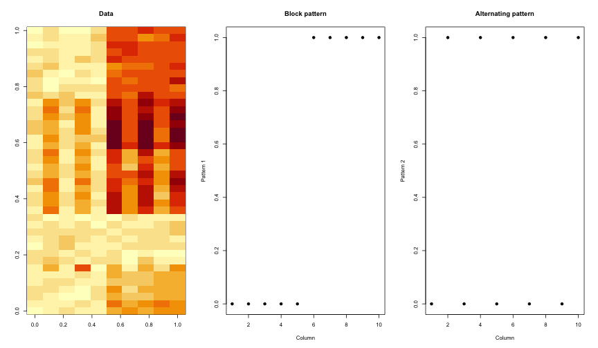

Now, of course the plot above shows the truth, which in general we will not know. 

We can apply the SVD/PCA to this matrix and see how well the patterns are picked up.

~~~~~~~~
> svd2 <- svd(scale(dataMatrixOrdered))
> par(mfrow = c(1, 3))
> image(t(dataMatrixOrdered)[, nrow(dataMatrixOrdered):1])
> plot(svd2$v[, 1], pch = 19, xlab = "Column", ylab = "First right singular vector")
> plot(svd2$v[, 2], pch = 19, xlab = "Column", ylab = "Second right singular vector")
~~~~~~~~

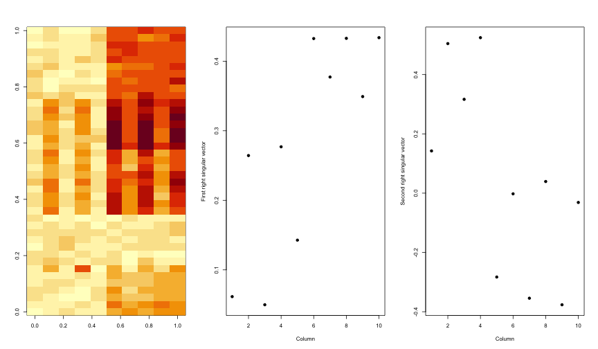

We can see that the first right singular vector seems to pick up both the alternating pattern as well as the block/step pattern in the data. The second right singular vector seems to pick up a similar pattern.

When we look at the variance explained, we can see that the first singular vector picks up a little more than 50% of the variation in the data.

~~~~~~~~
> svd1 <- svd(scale(dataMatrixOrdered))
> par(mfrow = c(1, 2))
> plot(svd1$d, xlab = "Column", ylab = "Singular value", pch = 19)
> plot(svd1{$$}d^2/sum(svd1{/$$}d^2), xlab = "Column", ylab = "Percent of variance explained", 
+     pch = 19)
~~~~~~~~

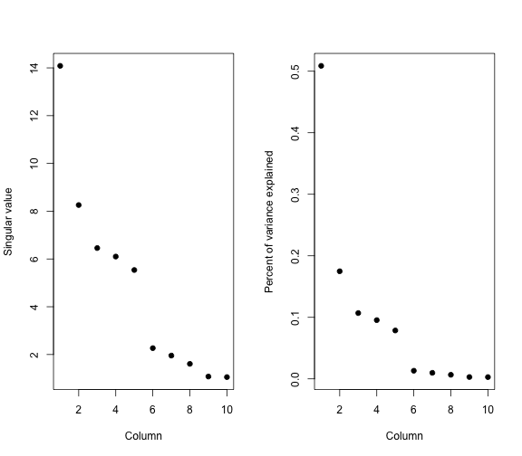

## Dealing with missing values

Missing values are a problem that plagues any data analysis and the analysis of matrix data is no exception. Most SVD and PCA routines simply cannot be applied if there are missing values in the dataset. In the event of missing data, there are typically a series of questions that should be asked:

* Determine the reason for the missing data; what is the *process* that lead to the data being missing?

* Is the proportion of missing values so high as to invalidate any sort of analysis?

* Is there information in the dataset that would allow you to predict/infer the values of the missing data?

In the example below, we take our dataset and randomly insert some missing data.

~~~~~~~~
> dataMatrix2 <- dataMatrixOrdered
> ## Randomly insert some missing data
> dataMatrix2[sample(1:100, size = 40, replace = FALSE)] <- NA
~~~~~~~~

If we try to apply the SVD on this matrix it won't work.

~~~~~~~~
> svd1 <- svd(scale(dataMatrix2))
Error in svd(scale(dataMatrix2)): infinite or missing values in 'x'
~~~~~~~~

Since in this case we know that the missing data appeared completely randomly in the data, it would make sense to try to impute the values so that we can run the SVD. Here, we use the `impute` package to do a k-nearest-neighbors imputation of the missing data. The `impute` package is available from the [Bioconductor project](http://bioconductor.org).

~~~~~~~~
> library(impute)
> dataMatrix2 <- impute.knn(dataMatrix2)$data
~~~~~~~~

Now we can compare how the SVD performs on the original dataset (no missing data) and the imputed dataset. Here, we plot the first right singular vector.

~~~~~~~~
> svd1 <- svd(scale(dataMatrixOrdered))
> svd2 <- svd(scale(dataMatrix2))
> par(mfrow = c(1, 2))
> plot(svd1$v[, 1], pch = 19, main = "Original dataset")
> plot(svd2$v[, 1], pch = 19, main = "Imputed dataset")
~~~~~~~~

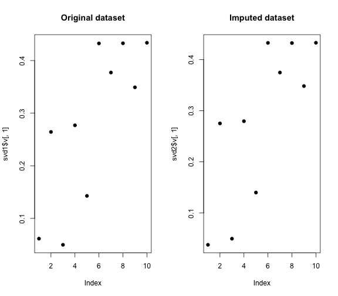

We can see that the results are not identical but they are pretty close. Obviously, the missing data process was pretty simple in this case and is likely to be more complex in other situations. 

## Example: Face data

<!-- ## source("http://dl.dropbox.com/u/7710864/courseraPublic/myplclust.R") -->

In this example, we use some data that make up an image of a face and show how the SVD can be used to produce varying approximations to this "dataset". Here is the original data.

~~~~~~~~
> load("data/face.rda")
> image(t(faceData)[, nrow(faceData):1])
~~~~~~~~

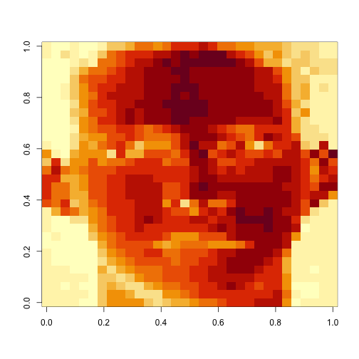

If we take the SVD and plot the squared and normalized singular values, we can see that the data can be explained by just a few singular vectors, maybe 4 or 5.

~~~~~~~~
> svd1 <- svd(scale(faceData))
> plot(svd1{$$}d^2/sum(svd1{/$$}d^2), pch = 19, xlab = "Singular vector", ylab = "Variance explained")
~~~~~~~~

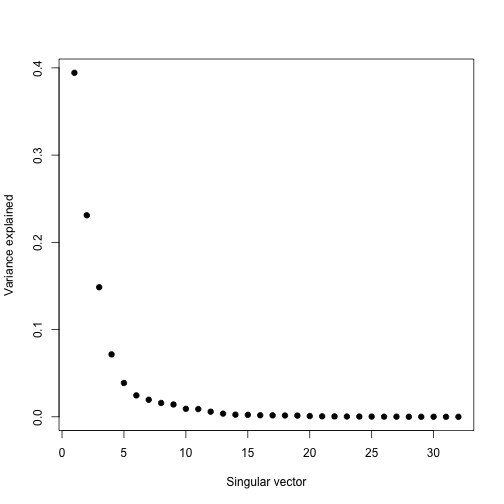

Now we can start constructing approximations to the data using the left and right singular vectors. Here we create one using just the first left and right singular vectors.

~~~~~~~~
> ## Note that %*% is matrix multiplication Here svd1$d[1] is a constant
> approx1 <- svd1$u[, 1] %*% t(svd1$v[, 1]) * svd1$d[1]
~~~~~~~~

We can also create ones using 5 and 10 singular vectors, which presumably would be better approximations.

~~~~~~~~
> # In these examples we need to make the diagonal matrix out of d
> approx5 <- svd1$u[, 1:5] %*% diag(svd1$d[1:5]) %*% t(svd1$v[, 1:5])
> approx10 <- svd1$u[, 1:10] %*% diag(svd1$d[1:10]) %*% t(svd1$v[, 1:10])
~~~~~~~~

Now we can plot each one of these approximations along with the original data.

~~~~~~~~
> par(mfrow = c(1, 4))
> image(t(approx1)[, nrow(approx1):1], main = "1 vector")
> image(t(approx5)[, nrow(approx5):1], main = "5 vectors")
> image(t(approx10)[, nrow(approx10):1], main = "10 vectors")
> image(t(faceData)[, nrow(faceData):1], main = "Original data")
~~~~~~~~

Here, the approximation using 1 singular vector is pretty poor, but using 5 gets us pretty close to the truth. Using 10 vectors doesn't seem to add much to the features, maybe just a few highlights. So 5 singular vectors is a reasonable approximation in this case. 

## Notes and further resources

* For PCA/SVD, the scale/units of the data matters

* PC's/SV's may mix real patterns, as we saw in the example with two overlayed patterns

* SVD can be computationally intensive for very large matrices

* [Advanced data analysis from an elementary point of view](http://www.stat.cmu.edu/~cshalizi/ADAfaEPoV/ADAfaEPoV.pdf)

* [Elements of statistical learning](http://www-stat.stanford.edu/~tibs/ElemStatLearn/)

* Alternatives and variations
  * [Factor analysis](http://en.wikipedia.org/wiki/Factor_analysis)
  * [Independent components analysis](http://en.wikipedia.org/wiki/Independent_component_analysis)
  * [Latent semantic analysis](http://en.wikipedia.org/wiki/Latent_semantic_analysis)

